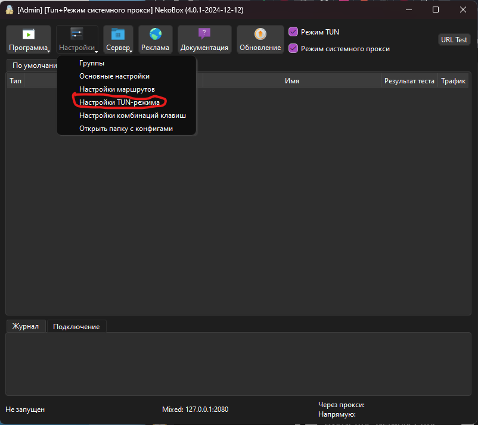
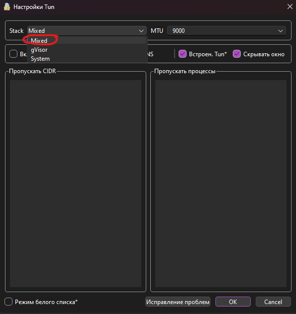
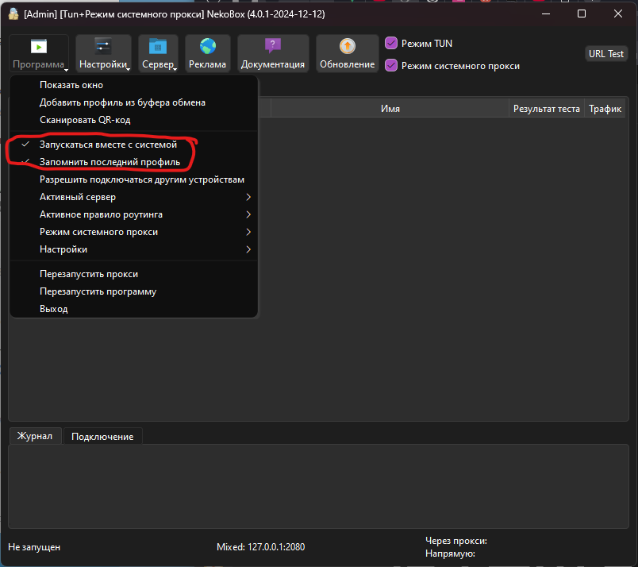
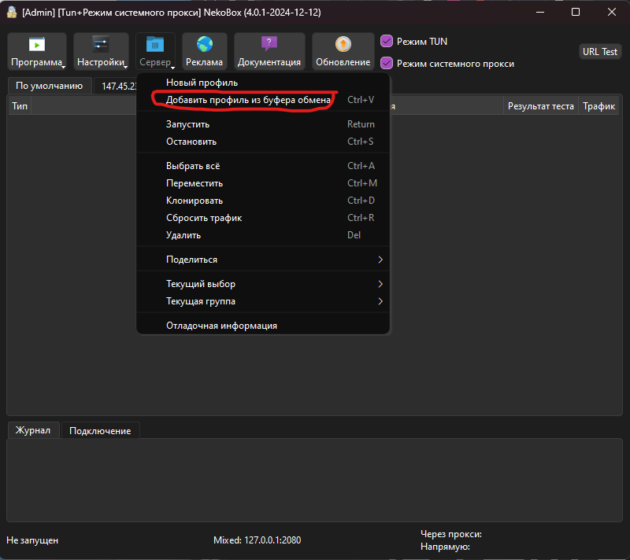
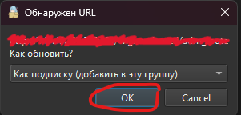
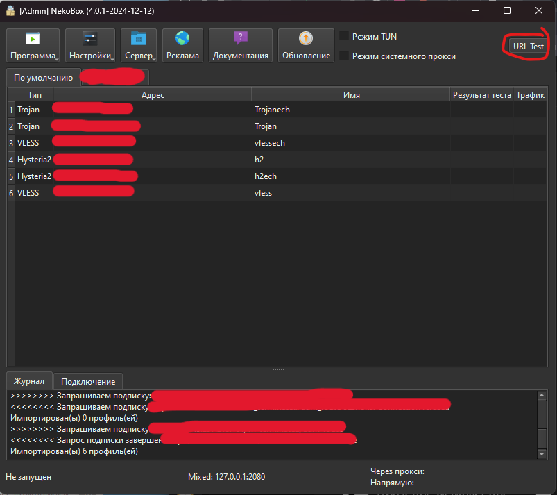
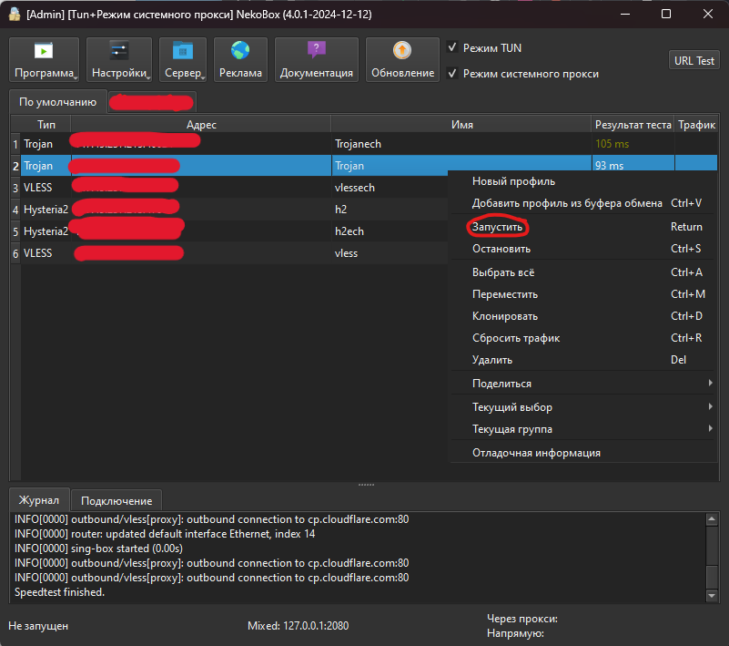

В этом разделе представлена пошаговая инструкция с визуальным сопровождением по настройке Terminator VPN на Windows
---

### 0. 

По ссылке (https://github.com/MatsuriDayo/nekoray/releases) скачайте последний релиз для windows,распакуйте его, **и запустите nekobox.exe от имени администратора**

---

---

### 1. 
В параметрах выберите "Настройки TUN-режима"

---

### 2.
* Выберите режим "Mixed"
* Установите флажок на пункте "Fake DNS"
* Нажмите "ОК" и вернитесь в основное меню
  

---

### 3.
В случае если хотите, чтобы клиент сам подключался к серверам, включите эти пункты

---

### 4.
Теперь скопируйте ссылку, которую вам прислал бот, и выберите "Добавить профиль из буфера обмена"

---

### 5.
Нажмите "ОК"

---

### 6.
Запустите пинг всех доступных серверов

---

### 7.
Подключитесь к серверу с минимальным пингом или к любому, который вам понравится

---
