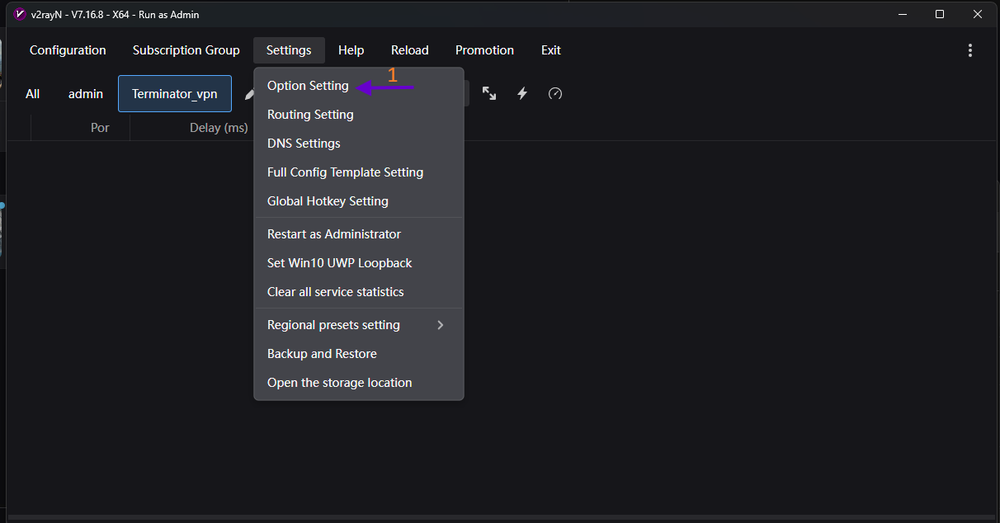
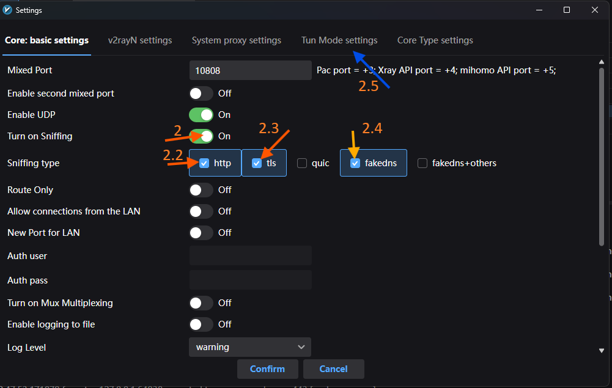
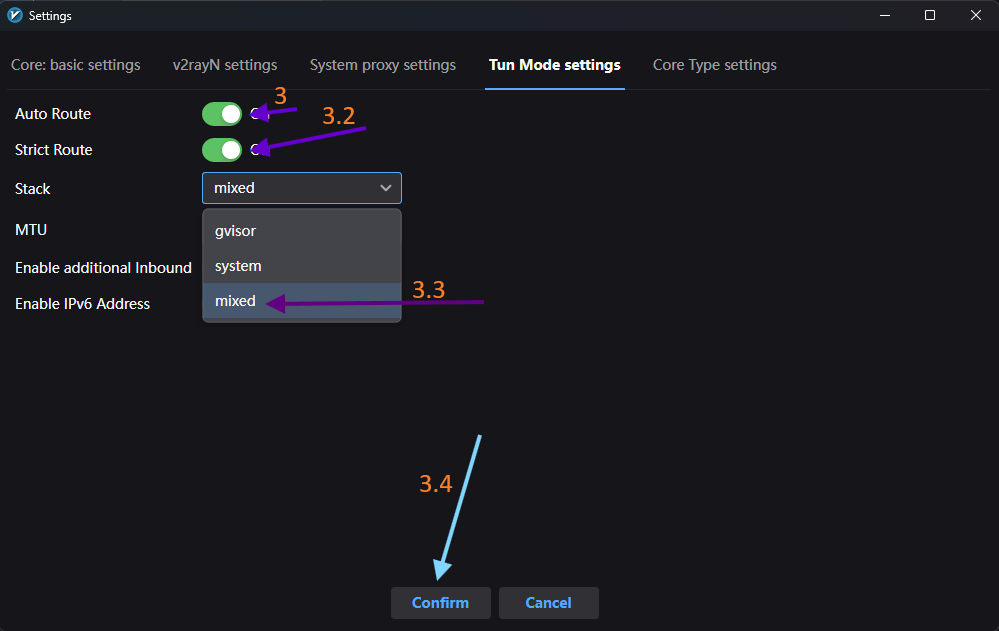
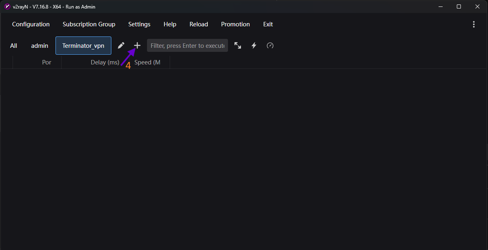
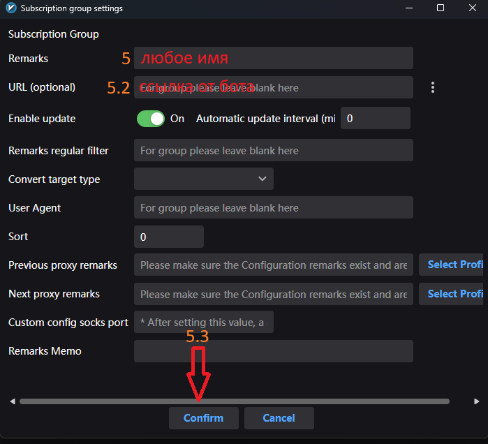
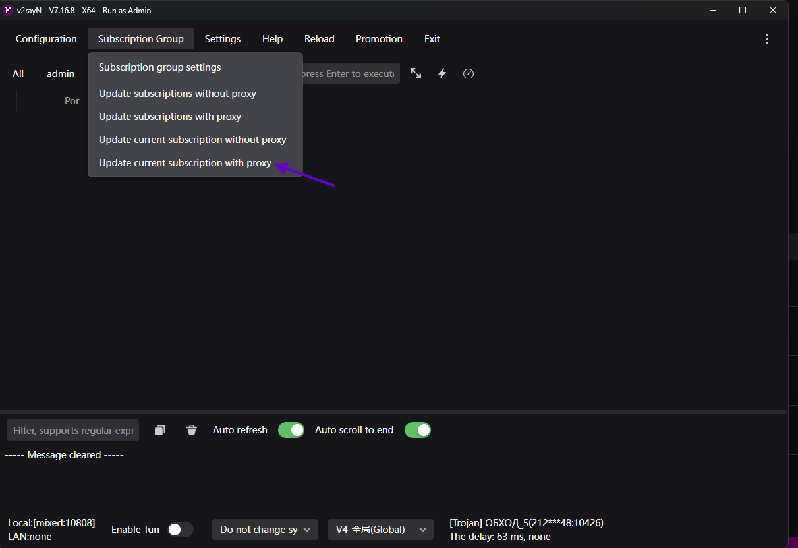
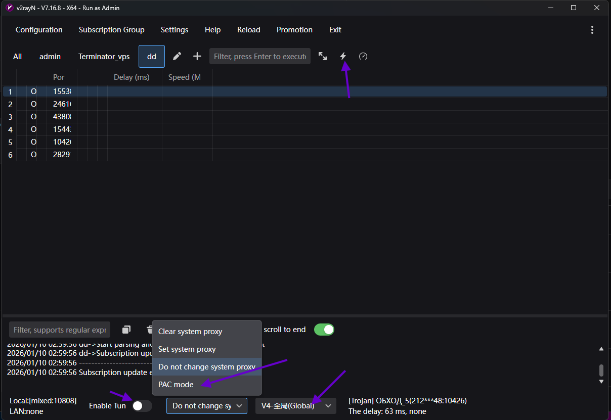
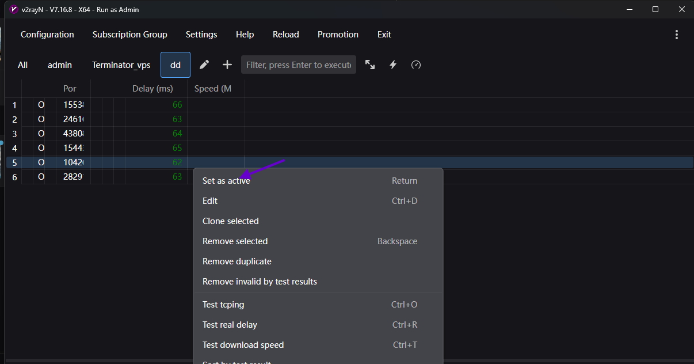

В этом разделе представлена пошаговая инструкция с визуальным сопровождением по настройке Terminator BPN на Windows
---

По [ссылке](https://github.com/2dust/v2rayN/releases) скачайте последний релиз для windows,распакуйте его, **и запустите v2rayn.exe от имени администратора**

---

---

---

---

---

---

---

---

---

---

---

